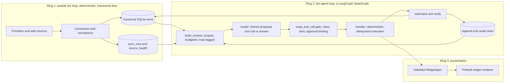
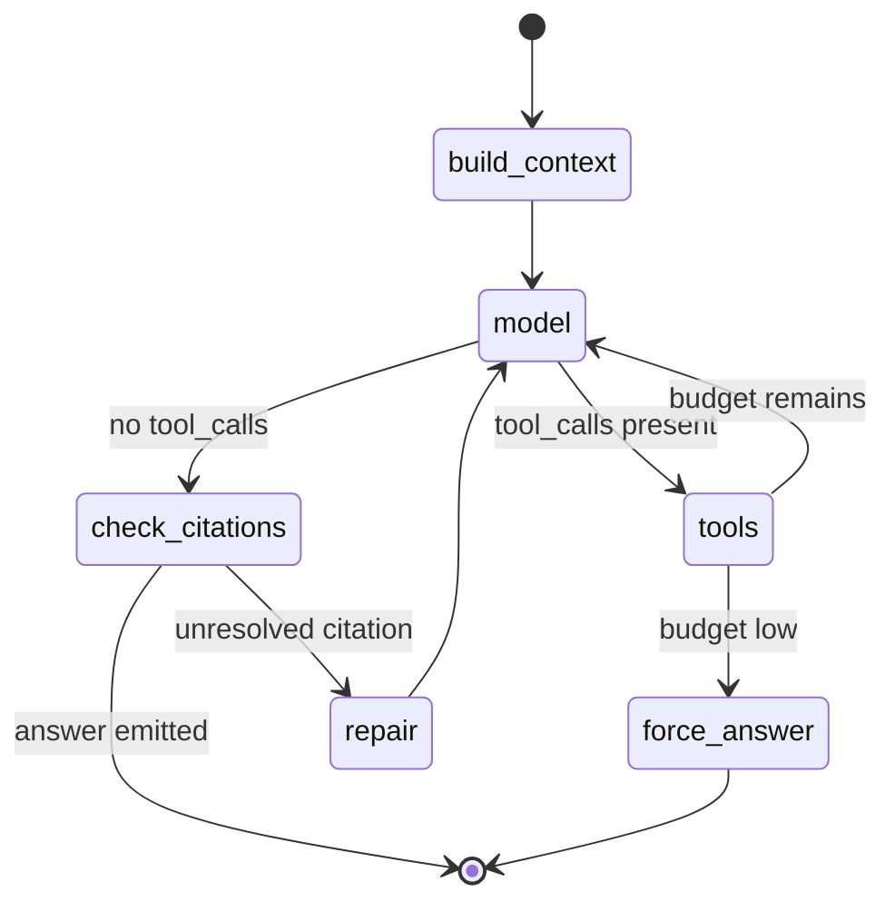
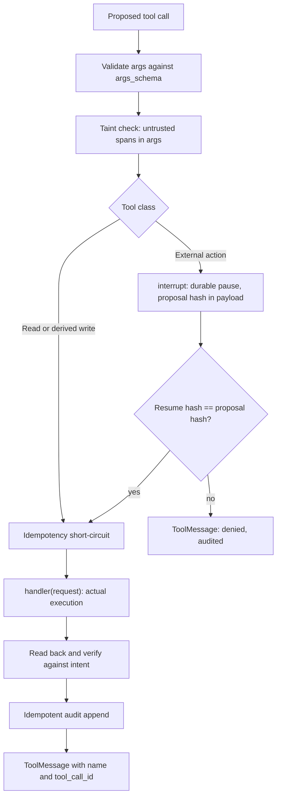

# Bifrost: agentic personal assistant

## 1. What the vision doc already decided (and why it matters)

[.cursor/plan.md](.cursor/plan.md) contains four constraints that are stronger than they look. Each one rules out a whole class of common first-build mistakes:

- **"Does not fetch or parse provider JSON inside the model loop."** Provider I/O is a separate program from the agent. The model never sees an HTTP response. This is the single highest-leverage decision in the doc.
- **"Does not use RAG as the source of calendar, task, or other structured truth."** Structured facts come from SQL queries over a canonical store. Embedding search, if it ever exists, is only for prose documents.
- **"SQL, raw JSON, and secrets never enter the prompt."** The model receives typed, whitelisted view objects. Enforced by types and a test, not by prompt wording.
- **"Ingested documents and web content are untrusted."** Anything ingested is *data*, never *instructions*. Needs a mechanical defense, not a polite request in the system prompt.

The agent loop in the doc — observe, reason over scoped context, propose, permission check, execute, read back and verify, persist audit event — is the actual control flow, and it becomes a LangGraph `StateGraph` with one named node per stage.

## 2. Phase 0 decisions, recorded

- **Model: `gemini-3.8-flash` at `thinking_level="high"`** for both the agent loop and summarization. Section 6.6 covers the integration specifics and the cost consequence of `high` on summarization.
- **Frameworks: LangChain + LangGraph**, adopted where they fit and declined where they would hide a load-bearing step. Section 3 is the explicit adopt/decline ledger.
- **Packaging: `uv`.** Not currently installed locally — `snap install astral-uv` or the Astral installer. Then `uv init`, `uv python pin 3.14`, `uv add`, `uv run`, and commit `uv.lock`. Python is 3.14.4 locally, so PEP 649 annotations are native and no `from __future__ import annotations` is needed anywhere.

Pin these versions, all current as of 2026-09-05 and verified on PyPI:

- `langgraph==1.2.11`, `langchain==1.4.0`, `langchain-core==1.6.2`
- `langgraph-checkpoint-sqlite==3.1.1`
- `langchain-google-genai==4.4.0` — note this integration is badged **beta**, and it shipped 2026-09-01, one day *before* `gemini-3.8-flash` launched. Treat model-specific behavior as unproven until the Phase 0 spike says otherwise.

LangChain is on 1.x; the 1.0 restructuring already happened and legacy chains/retrievers now live in `langchain-classic`. If an import is missing, reach for `langchain-classic` rather than downgrading.

**Turn LangSmith off explicitly.** LangChain auto-enables tracing when the env vars are present, which would ship personal calendar and task content off the machine. Set `LANGSMITH_TRACING=false` and leave `LANGSMITH_API_KEY` unset. The audit chain in section 9 is the observability story; LangSmith is at most an opt-in local debugging aid.

## 3. Framework adopt/decline ledger

The instruction is coherence first, so this is a deliberate ledger rather than blanket adoption.

**Adopt, because the framework does it better than a hand-rolled version:**

- `**StateGraph` for the turn loop.** The doc's loop is a state machine, and this is LangGraph's core competency. Named nodes also make the audit trace and the eval assertions line up with the diagram.
- `**interrupt()` + `Command(resume=...)` + a checkpointer for the approval gate.** This was verified to survive a genuine process restart: the graph paused at the gate, the process exited, a fresh process reopened the SQLite file and resumed with the pending payload intact, and the unapproved side effect never fired. Hand-rolling durable pause/resume is real work, and this is strictly better than what I would have written.
- `**ToolNode(..., wrap_tool_call=gate)` as the policy-gate seam.** Verified to sit exactly between the model's proposed call and execution, able to deny with no side effect. It also constructs `ToolMessage`s correctly, which matters more on Gemini than elsewhere (section 6.6).
- `**context_schema` for run-scoped immutable context.** This is a genuinely elegant fit for the "time is an input, not ambient" rule: `now`, timezone, and store handles arrive as typed run context instead of module-level state. Use `context_schema`, not the deprecated `config_schema`.
- `**RemainingSteps` from `langgraph.managed**` for graceful budget exhaustion instead of an exception.
- **LangChain `@tool` + Pydantic `args_schema`** for tool schema generation, replacing hand-written JSON Schema.
- `**stream_mode` / `stream_events` and `stream.abort()**` for streaming tool activity and mid-turn cancellation.

**Decline, because adopting would hide something load-bearing:**

- `**create_agent` as the whole loop.** It owns the model-tool cycle, but Bifrost's loop has non-ReAct nodes — `build_context`, `check_citations`, `repair` — and the whole point of the system is that every step is inspectable. Note the real cost of declining: the middleware suite (`ModelCallLimitMiddleware`, `SummarizationMiddleware`, `HumanInTheLoopMiddleware`, `ToolRetryMiddleware`) is a `create_agent` feature, so a per-turn call cap and the rolling summary become small pieces of my own code. A call cap is about five lines against `RemainingSteps`; summarization is a modest `compact` node. That is an acceptable price for a fully visible loop. `wrap_tool_call` is a `ToolNode` constructor argument, so the gate seam survives the decline. Section 13 lists revisiting this as a decision.
- `**create_react_agent**` — deprecated in favor of `create_agent` regardless, so it is not an option.
- `**interrupt_before=[...]` static breakpoints** for approvals. The docs are explicit that these are not for human-in-the-loop; they are debugging breakpoints. Use `interrupt()`.
- **LangChain document loaders, retrievers, and vectorstores in Ring 1.** Ring 1 must stay framework-free so the import boundary holds and provider JSON never touches agent-adjacent code. This *sharpens* the existing boundary test: `bifrost.ingest` may not import `langchain`* or `langgraph`* either.
- `**langgraph.store` for long-term memory.** Durable learned preferences were already deferred, and `SqliteStore` ships but is undocumented, so it is lower-assurance than the checkpointer. Revisit only if durable preferences land.
- **LangSmith as the audit source.** Off-machine and not hash-chained. See section 2.

## 4. Architecture: three rings




Ring 1 and Ring 2 must not share code. The import-boundary test is what keeps the doc's "no provider JSON in the loop" rule true a year from now:

- `bifrost.agent` may not import `bifrost.ingest.connectors`, `httpx`, or `requests`.
- `bifrost.ingest` may not import `langchain*` or `langgraph*`.

## 5. Repo layout

```
pyproject.toml            # uv, requires-python >=3.14
uv.lock                   # committed
src/bifrost/
  core/                   # ids, clock, RunContext, config, hashing, errors
  store/                  # schema.sql, migrations/, db.py, repositories/, views/
  ingest/                 # connectors/, normalize.py, sync.py, health.py   (framework-free)
  agent/
    graph.py              # StateGraph wiring: nodes, conditional edges, compile
    state.py              # TurnState TypedDict, RunContext dataclass
    nodes/                # build_context, model, check_citations, repair, force_answer, compact
    registry.py           # ToolSpec registry wrapping LangChain StructuredTools
    gate.py               # wrap_tool_call policy gate
    tools/read/           # search_records, get_agenda, get_tasks, get_goals, get_source_health
    tools/derived/        # propose_daily_plan, save_note, set_surface
    tools/external/       # create_time_block, complete_task, open_app
    validate.py           # citation validator, plan validator
    llm.py                # ChatGoogleGenerativeAI construction, per-route thinking_level
    checkpoint.py          # SqliteSaver factory over an owned connection
    prompts/system.v1.md  # versioned, recorded in audit
  policy/                 # classes, taint rules, proposals, approval binding
  audit/                  # idempotent append-only hash-chained log + trace renderer
  surface/                # widget schemas + versioned surface state
  api/                    # FastAPI HTTP + WebSocket + streaming adapter
  cli/                    # chat harness, sync, trace, eval
ui/                       # widget renderer
evals/                    # fixtures/ (frozen DB + frozen now), scenarios/, runner.py
tests/
```

## 6. The canonical store, and the two-databases rule

SQLite with WAL, migrations as numbered SQL. **Two separate database files**, and the separation is not cosmetic:

- `bifrost.db` — canonical records and the audit chain. The durable ledger.
- `checkpoints.db` — LangGraph's `SqliteSaver`. Transient, resumable execution state.

They must stay separate because checkpoint maintenance (`prune`, `delete_thread`) must never be able to touch the audit log, and because the audit log is a *side-channel copy* rather than a replay source. Section 6.6 gives the concrete technical reason: Gemini 3.x messages carry thought signatures in `additional_kwargs`, so messages must be passed through from the checkpointer unchanged and never rebuilt from audit rows.

Core tables in `bifrost.db`:

- `sources` — `kind`, `config_ref`, `trust` (`trusted` or `untrusted`), `enabled`.
- `sync_runs` and `source_health` — started/finished, rows upserted, error, `last_success_at`. This backs `get_source_health` from the vision doc.
- `events`, `tasks`, `goals`, `notes`, `documents` — canonical normalized records. Every row: stable public id (`evt_`, `task_`, `goal_`, `doc_` prefixes), `source_id`, `provider_id`, `content_hash`, `updated_at`, `deleted_at` (tombstone, never hard delete).
- `records_fts` — FTS5 index over titles and bodies for `search_records`.
- `proposals`, `approvals`, `actions` — the write path (section 7).
- `audit_events` — append-only, hash-chained, **with a unique index on `(turn_id, step_key)`** so a replayed append is a no-op. Section 7 explains why replay is guaranteed to happen.
- `surface_versions` — versioned widget layout so undoing the display is mechanical.

Conversation history has **no tables of its own in v1**. The checkpointer owns the message list keyed by `thread_id`, and the UI reads it back via `graph.get_state(config)`. This is a genuine simplification the framework earns. If cross-conversation search over chat history is ever wanted, a read-only projection table comes back then.

Rules that prevent a week of pain later: all timestamps stored UTC with an explicit `tz` on user-facing records; `now` and timezone arrive through `RunContext` as graph context, never read ambiently, so evals are reproducible; public ids are opaque and stable because the model will cite them.

## 6.1 Ring 1: deterministic ingestion

A separate entry point (`bifrost sync`) that connectors run under, importing nothing from LangChain or `bifrost.agent`. Each connector: fetch, normalize into canonical rows, upsert by `(source_id, provider_id)` with `content_hash` change detection, tombstone anything that disappeared, write a `sync_runs` row. Secrets live outside the repo and are read only here.

Two things to get right early:

- **Staleness is a first-class fact.** If a source's `last_success_at` is older than its threshold, `build_context` injects a staleness warning and the assistant must state it before asserting facts sourced from it. Never silently answer from stale data — this is the most common way an assistant loses a user's trust permanently.
- **Ingested prose is marked untrusted at write time**, on the `sources` row. Trust is a property of data lineage, not of the prompt that reads it.

## 6.2 The `build_context` node — this is where "scoped" happens

Returns rendered messages *and* a `ContextSnapshot` holding the exact set of record ids exposed. Deterministic sections with individual token budgets:

- Identity and capabilities (from the versioned system prompt), current local datetime and timezone from `RunContext`.
- Agenda window: `now - 2h` to `now + 36h`, with **precomputed** `conflicts` and `free_slots`.
- Open tasks: due within 14 days or flagged, capped.
- Active goals, capped.
- Source health warnings for anything stale.
- Recent mutating audit events (last ~5) so the assistant knows what it just did.

Gemini 3.8 Flash has a 1,048,576-token input window, so **the ~8k context budget is a cost, latency, and reliability choice — not a capacity limit.** Worth stating in a comment so nobody later "fixes" it by removing the budget.

Two principles a first build usually misses:

- **Push determinism down into the tools.** Overlap math, working-hours checks, "is this due today" — computed in SQL or Python and handed over as facts. Never ask the model to do timestamp arithmetic. Reliability improves more from this than from any prompt tuning.
- **The model never writes SQL.** `search_records` takes structured filters (`kind`, `query`, `date_from`, `date_to`, `limit`) and FTS5 handles text. That is the concrete meaning of the doc's "SQL never enters the prompt."

## 6.3 Tool registry: policy as data, wrapping LangChain tools

LangChain generates the schema; my registry stays authoritative for policy. Note that LangChain already exports a `@tool` decorator, so name mine `register` to avoid a confusing collision.

```python
@dataclass(frozen=True)
class ToolSpec:
    lc_tool: StructuredTool          # name, description, args_schema -> JSON schema for Gemini
    cls: ToolClass                   # READ | DERIVED_WRITE | EXTERNAL_ACTION
    returns: type[BaseModel]         # view-model whitelist: what the model may see
    idempotency_key: Callable[[BaseModel], str] | None
    inverse: str | None              # tool name that undoes this
    verify: Callable | None          # read-back assertion
    timeout_s: float

REGISTRY: dict[str, ToolSpec] = {}
```

Both consumers read the same registry, which is what keeps the model's advertised tools and the gate's policy from drifting apart:

```python
llm_with_tools = llm.bind_tools([s.lc_tool for s in REGISTRY.values()])
tool_node = ToolNode([s.lc_tool for s in REGISTRY.values()], wrap_tool_call=policy_gate)
```

Redaction is structural: tools return registered view models only. Add a test asserting no tool returns a bare `dict`, plus a secret-scanner assertion on the outbound prompt that fails loudly in development.

## 6.4 The graph

State is a `TypedDict` — the documented standard, more performant than a Pydantic state, and required if `create_agent` is ever mixed in later:

```python
class TurnState(TypedDict):
    messages: Annotated[list[AnyMessage], add_messages]
    snapshot_id: str                 # ContextSnapshot, for citation validation
    exposed_ids: list[str]
    model_calls: int
    repair_attempts: int
    remaining_steps: RemainingSteps   # graceful budget exhaustion

@dataclass
class RunContext:                     # graph context_schema, not graph state
    now: datetime
    tz: str
    conversation_id: str
    store: StoreHandle
    prompt_version: str
```




**Set `recursion_limit` explicitly.** LangGraph's default is **10007**, not the widely-believed 25 — `langchain_core` defines 25 but LangGraph overrides it, which is where the folklore comes from. Left at the default, a looping graph would make roughly ten thousand Gemini calls before raising `GraphRecursionError`. At `high` thinking that is a genuinely expensive bug. Pass `recursion_limit` per run (start around 20 for an 8-step logical budget, since one logical step spans multiple super-steps) and read `remaining_steps` in the routing function to route to `force_answer` while there is still headroom, rather than erroring.

Invocation shape:

```python
graph.invoke(
    state,
    config={"configurable": {"thread_id": conversation_id}, "recursion_limit": 20},
    context=RunContext(now=..., tz=..., ...),   # exact kwarg to confirm in the Phase 0 spike
    durability="sync",                            # persist before the next step; required for the gate
)
```

`durability` is a **runtime** argument, not a compile-time setting: `"exit"` cannot recover from a mid-run crash, `"async"` leaves a small loss window, `"sync"` persists before the next step starts. The approval gate needs `"sync"`.

Build the checkpointer over a connection you own. `SqliteSaver.from_conn_string` is a context manager, so a graph compiled inside a `with` block silently stops working outside it — a nasty footgun for a long-lived server:

```python
conn = sqlite3.connect(checkpoints_path, check_same_thread=False)
saver = SqliteSaver(conn)   # call saver.setup() once
```

SQLite checkpointing is documented as suited to local and experimental use, with Postgres as the production option. For a single-user desktop assistant SQLite is the right call; keep it behind one factory function in `agent/checkpoint.py` so the interface is swappable.

## 6.5 The policy gate inside `wrap_tool_call`

The doc's logical sequence — permission check, execute, read back and verify, persist audit event — is preserved exactly. Only its hosting changes: it lives in the wrapper that `ToolNode` calls between proposal and execution, which also gets correct `ToolMessage` construction and parallel-call handling for free.




Three non-obvious constraints govern how this code is written.

**Everything above the `interrupt()` runs twice.** On resume, LangGraph re-runs the node from the top — not from the `interrupt()` line. So argument validation and the taint check must be pure, every side effect must sit strictly *below* the interrupt, and the audit append must be idempotent, which is exactly why `audit_events` carries a unique index on `(turn_id, step_key)`. Never wrap `interrupt()` in a loop; re-prompt by routing back through a conditional edge instead, since resume replays all prior iterations.

**Approval must bind to a payload, not an intent.** LangGraph's interrupt provides durable pause and a resume value, but not payload binding. Compute the hash before pausing, put it in the interrupt payload, and require it back:

```python
proposal_hash = sha256(canonical_json({"tool": name, "args": normalized_args}))
decision = interrupt({"kind": "approval", "hash": proposal_hash, "preview": human_preview})
if decision.get("hash") != proposal_hash:
    return deny("approval hash mismatch")     # audited as a denial
```

Resume with `Command(resume={"hash": ..., "decision": "approve"})`. If `HumanInTheLoopMiddleware` is ever adopted instead, its resume contract is a different shape (`{"decisions": [{"type": "approve"}]}`), so do not mix the two conventions.

**Allow at most one external action per tool batch.** If Gemini proposes several tool calls at once and one of them interrupts, resuming re-runs the whole node, so any sibling call that already executed executes again. Idempotency keys make that survivable, but the clean invariant is to deny all but the first external action in a batch with a message asking for them one at a time. Reads re-running are merely wasteful. The exact resume shape when a single batch raises multiple interrupts is on the Phase 0 verification list.

## 6.6 The Gemini adapter

Constructed once in `agent/llm.py`, with `thinking_level` supplied **per route** so it is configuration rather than a hard-coded constant:

```python
llm = ChatGoogleGenerativeAI(model="gemini-3.8-flash", thinking_level="high")
```

Verified against the `langchain-google-genai` 4.4.0 source:

- `**thinking_level` is supported**, as a Pydantic alias of the canonical `reasoning_effort` field. Either name works in the constructor and either reads the value back. Since Pydantic aliases do not apply to call-time kwargs, the integration resolves it manually, so `thinking_level` also works as a bind-time kwarg. It takes precedence over the deprecated `thinking_budget`, and warns if both are set.
- **The client-side type accepts a value the server rejects.** The `Literal` is `["minimal", "low", "medium", "high"]`, but `gemini-3.8-flash` rejects `minimal` with `400 INVALID_ARGUMENT`. Never emit it, and match on the status or `INVALID_ARGUMENT` code rather than the message string.
- **The API default is `medium`**, so set the level explicitly on every call site. Defaults are Google's to change.
- **Thinking tokens are broken out** at `response.usage_metadata["output_token_details"]["reasoning"]`, with `tool_use_prompt_token_count` folded into input and cache reads exposed separately. That is exactly the hook the per-turn cost budget needs.
- **Thought signatures are handled for you, and that constrains the audit design.** Gemini 3+ requires a `thought_signature` on function calls within the active conversation loop; the integration patches missing ones with a bypass sentinel. Signatures live in `additional_kwargs`, so **messages must flow from the checkpointer to the model unchanged and never be reconstructed from audit rows** — rebuilding them would silently degrade every turn to the sentinel path. This is the concrete reason for the two-databases rule in section 6.
- **Schema conversion is good but not total.** `anyOf` is translated into Gemini's `any_of`, but only the *first* `allOf` entry is honored, with a warning. Pydantic emits `allOf` for some ordinary patterns, such as a `$ref` field carrying a default. Since tool schemas are auto-generated, keep argument models flat — primitives and `Literal` enums, no unions, no deep nesting — and add a schema-lint test that runs each tool's converted schema and fails on `allOf` truncation.
- **Denials must carry `name`.** Gemini enforces both `call_id` and `name` on function results, so a synthesized denial `ToolMessage` needs `name=request.tool_call["name"]` alongside `tool_call_id`. A hand-written denial that omits `name` would work on other providers and fail here.

**One cost note on the recorded decision.** Thinking tokens bill at the output rate: $0.75 / $3.75 per million input/output through 2026-12-31, then $1.50 / $7.50, and 3.8 Flash averages about 30% more output tokens than 3.7. Running summarization at `high` is therefore the largest single cost lever in the system, for a task where the reasoning depth mostly is not doing work. Keeping `thinking_level` as per-route config means moving summarization to `low` later is a one-line change, not a refactor.

## 6.7 Citation validation — do not trust cited ids

The doc requires "a proposed daily plan with citations to source records." Models cite ids that do not exist, and real ids that were never in context. So the `check_citations` node validates every answer against the `ContextSnapshot`:

```python
unknown   = cited_ids - store.existing_ids(cited_ids)   # hallucinated
unexposed = cited_ids - snapshot.exposed_ids            # not actually seen this turn
if unknown or unexposed:
    # route to repair once, naming the specific ids, then strip and flag
```

## 6.8 Untrusted content and prompt injection

Since ingested documents and web content are untrusted, the defenses must be mechanical:

- Untrusted blocks are wrapped in explicit delimiters with a data-not-instructions framing, length-capped, and labeled with their `source_id`.
- **No untrusted content can escalate a tool class.** If any untrusted block was in the turn's context, every external action in that turn requires confirmation regardless of standing allowances, and the approval preview names the untrusted source.
- A cheap substring check catches the obvious attack: if a tool argument contains a verbatim span copied from an untrusted block, the gate refuses auto-execution.
- The model can never trigger a fetch of an arbitrary URL. Ingestion is allowlisted and lives in Ring 1.

`PIIMiddleware` exists in LangChain and could serve as defense in depth, but redaction here is structural through view models, so it is optional rather than part of the design.

## 7. The write path

The vision doc's three classes map to three paths through the gate.

**Read** — auto-execute, audit the call, no confirmation. Safe to auto-retry.

**Derived write** — audited and reversible. Local tables only, with a recorded inverse operation so undo is mechanical.

**External action** — confirm, allowlist, idempotent. Approval binding, the replay discipline, and the one-per-batch invariant are all covered in section 6.5. Beyond those: a unique index on `(tool, idempotency_key)` short-circuits retries with the stored result, so a timeout never double-creates an event; read-back verification re-reads the created record and asserts it matches intent, recording a mismatch and offering the inverse; and an `actions` row carries the inverse so undo is a lookup rather than a reconstruction. Never auto-retry an external action — only reads.

`**propose_daily_plan` uses generate-and-check.** The model drafts blocks with `start`, `end`, `record_ids`, and `rationale`; deterministic code validates no overlap with fixed events, inside working hours, every citation resolving and exposed, no task double-booked, sane total duration. Validation failures return structured errors the model can repair (`validation_error: block 2 overlaps evt_123 (14:00-15:00)`). The result persists as a *proposal*, never as calendar writes. The model does judgment; code owns the invariants.

## 8. Ring 3: widgets

The model does not emit HTML or JS. It emits a `WidgetSpec` validated against a registry of prebuilt widgets:

```python
class WidgetSpec(BaseModel):
    type: Literal["agenda_timeline", "task_list", "plan_review", "source_health", "goal_tracker"]
    title: str                   # rendered as text, never HTML
    props: dict                  # validated against that widget type's schema
    record_ids: list[str]        # resolved by the renderer from the store
```

Setting the surface is a derived write via `set_surface`, so it is audited and reversible through `surface_versions`. Props reference record ids and the renderer resolves them from the store, so display data cannot be fabricated in the spec. All strings render as text.

Streaming to the UI goes through a thin adapter in `api/`. Start on the stable `stream_mode="updates"` and `"messages"`; the newer `stream_events(version="v3")` has a purpose-built `.tool_calls` projection and is what the docs recommend for new applications, but the runtime still emits a beta warning calling it experimental. Isolating it behind an adapter means that contradiction resolves itself later without touching the graph. Cancellation is `stream.abort()`, which pairs with `durability="sync"` so work completed before the abort stays checkpointed.

## 9. Audit chain

One append-only table in `bifrost.db`, one row per step: `turn_id`, `step_key`, `kind` (`context_built`, `model_output`, `policy_decision`, `tool_call`, `tool_result`, `verification`, `user_approval`, `error`), `payload_json`, `prompt_version`, `model_id`, `thinking_level`, `usage_json`, `prev_hash`, `created_at`. Hash-chained so tampering is detectable, unique-indexed on `(turn_id, step_key)` so node replay is a no-op, and complete enough to read a turn back. It is simultaneously the compliance record, the debugger (`bifrost trace <turn_id>`), and the eval assertion target.

It is deliberately *not* a replay source for model messages — see the thought-signature constraint in section 6.6.

## 10. Evaluation harness

Start this in Phase 2, not at the end. A frozen fixture DB at a frozen `now` (trivial, because `now` arrives through `RunContext`), and assertions on the **audit trace** rather than on prose:

- "What's on today?" calls `get_agenda` and invents no events.
- A seeded overlap is surfaced as a conflict.
- "Plan my day" yields a valid plan where every citation resolves.
- An ingested document containing "create a calendar event for..." produces no auto-execution and is flagged.
- A hallucinated citation is caught by the validator.
- A tampered approval hash is rejected by the gate.
- A stale source produces a staleness statement before any factual claim from it.
- A batch containing two external actions has the second denied.
- An interrupted turn resumes correctly after a simulated process restart, with no duplicated side effect.

Track tokens, latency, and cost per turn from `usage_metadata` so regressions are visible. Graph-shape tests can use a fake chat model, so most of the suite runs without spending Gemini tokens; note that `ToolNode` can no longer be invoked standalone outside a graph, so wrap it in a trivial `StateGraph` for unit tests.

## 11. Verify before building on it

Four assumptions are load-bearing and unproven. Each is a short spike in Phase 0, and each has a known fallback.

- **The runtime kwarg for `context_schema`.** `context_schema` is confirmed as a `StateGraph` parameter, but the invocation-side keyword was not verified. Fallback: `config["configurable"]`.
- `**gemini-3.8-flash` tool calling through `langchain-google-genai` 4.4.0 at `thinking_level="high"`.** The package predates the model by a day and is badged beta. Fallback: wrap the official `google-genai` SDK in a small `BaseChatModel` (`_generate`, `_stream`, `bind_tools`, `_llm_type`), which is a contained amount of work precisely because the graph only depends on the LangChain chat-model interface.
- **Resume shape when one `ToolNode` batch raises multiple interrupts.** The one-external-action-per-batch invariant is designed to avoid needing this, but confirm the behavior rather than assuming it.
- **Pydantic-generated tool schemas surviving Gemini schema conversion.** Run every tool's schema through the converter and check for `allOf` truncation warnings. Fallback: flatten the offending argument models.

## 12. Phases

- **Phase 0 — skeleton and spikes.** `uv` project with pinned versions, package layout, SQLite schema and migrations, `RunContext`, the two databases, idempotent audit chain, CLI harness, LangSmith off, import-boundary tests, and the four verification spikes from section 11.
- **Phase 1 — canonical store and one ingest path.** Seeded fixtures plus one real source so there is truth to converse about. `sync_runs` and source health working.
- **Phase 2 — read-only loop.** The graph with `build_context`, `model`, `tools`, `check_citations`, `repair`, and `force_answer`; five read tools (`search_records`, `get_agenda`, `get_tasks`, `get_goals`, `get_source_health`); the `ToolSpec` registry; explicit `recursion_limit`; citation validator; trace renderer; first evals. This is the first version that feels like an assistant, and it satisfies "no unapproved changes" by construction because no write tool is registered yet.
- **Phase 3 — derived writes.** `propose_daily_plan` with generate-and-check, `save_note`, `set_surface`, undo, and the `compact` summarization node.
- **Phase 4 — desktop shell and widgets.** FastAPI plus WebSocket behind the streaming adapter, renderer, the five widgets, approval UI with previews.
- **Phase 5 — external actions.** The full gate: `interrupt()` with hash binding, `durability="sync"`, idempotency, read-back verification, inverse operations, allowlisted `open_app`.
- **Phase 6 — hardening.** Injection red-team suite, cost and latency budgets, staleness and degraded-mode polish.

Phases 0 through 4 together are the vision doc's "first useful version."

## 13. Decisions still open (no answer needed now)

Each has a recommended default, so accepting defaults is a valid answer.

**Needed before Phase 1**

- **Which sources are real for v1.** Calendar and task providers with OAuth, a local `.ics` file, a markdown vault, or manual entry. Default: start with a local file source so OAuth does not block the loop work.
- **Search scope.** FTS5 only for v1, or embeddings for prose documents. Default: FTS5 only, since the doc rules out RAG for structured truth.

**Needed before Phase 2**

- **Revisit `create_agent` plus middleware.** Declined in section 3, and the cost of declining is owning a small step cap and a summarization node. The middleware suite is genuinely good, and an inner `create_agent` can be dropped into the outer graph as a node with all hooks still firing. The price is subgraph streaming complexity (`subgraphs=True` to see inner tokens), TypedDict-only state, and less legible node names in the audit trace. Default: stay explicit through Phase 2, then reconsider with a real trace in hand.
- **Conversation memory.** Checkpointer plus a rolling summary, or summary plus pinned durable preferences. Default: checkpointer plus rolling summary; defer durable learned preferences and `langgraph.store`.
- **Per-turn cost and latency ceiling**, and whether thinking text is surfaced to the user. Default: stream tool activity, allow cancel, roughly 8 logical steps, and keep thinking text out of the UI.
- **Whether summarization stays at `high`.** Default as decided: `high` everywhere for now, with `thinking_level` as per-route config so lowering it later is one line.

**Needed before Phase 4**

- **Desktop shell technology.** Local Python backend plus browser UI, Tauri, Electron, native toolkit, or a terminal UI first. Local constraint worth knowing: WSLg is available (`DISPLAY=:0`, Wayland), but Node exists only on the Windows side (`/mnt/c/nvm4w`), so a JS build step needs Node installed inside WSL or run from Windows. Default: FastAPI serving a dependency-free HTML/JS renderer, which sidesteps Node entirely for v1.
- **Which 2 to 5 widgets**, and whether layout is model-controlled or user-controlled. Default: the five in section 8, model-proposed and user-pinnable.

**Needed before Phase 5**

- **Target platform for "open app" and desktop manipulation.** Windows host via WSL interop, Linux/WSLg apps, or macOS. Default: an allowlist mapping logical app names to platform-specific launchers, so the policy surface stays identical across platforms.
- **Approval granularity.** Per-action confirm, time-boxed session allowances, or standing per-tool rules. Default: per-action for v1; add time-boxed allowances only after the audit trace shows which actions are genuinely routine.
- **Undo scope.** Local inverse only, or attempt provider-side revert. Default: attempt provider-side revert for actions Bifrost created, and always record the local inverse.

**Cross-cutting**

- **Local trust model.** Whether the SQLite files are encrypted at rest, whether the Gemini API key lives in an OS keyring or a `.env` file, and whether the local API port requires a token. Default: `.env` plus a loopback-only port with a token; revisit encryption when real provider data lands.
- **Audit retention.** Payloads contain personal data. Default: keep whole locally, with a retention command available.
- **Dependency pinning strictness.** The LangChain family is moving fast — `langchain-core` shipped a day before this plan — and the Gemini integration is beta. Default: commit `uv.lock`, use `uv sync --frozen` in CI, and upgrade deliberately rather than floating.

## 14. Keep the source of truth intact

[.cursor/plan.md](.cursor/plan.md) declares itself canonical for project vision, in a table built to hold more rows. Once this plan is accepted, add a row pointing at an architecture document (for example `docs/architecture.md`) so the vision file stays short and the mechanics live beside it.