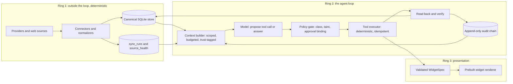
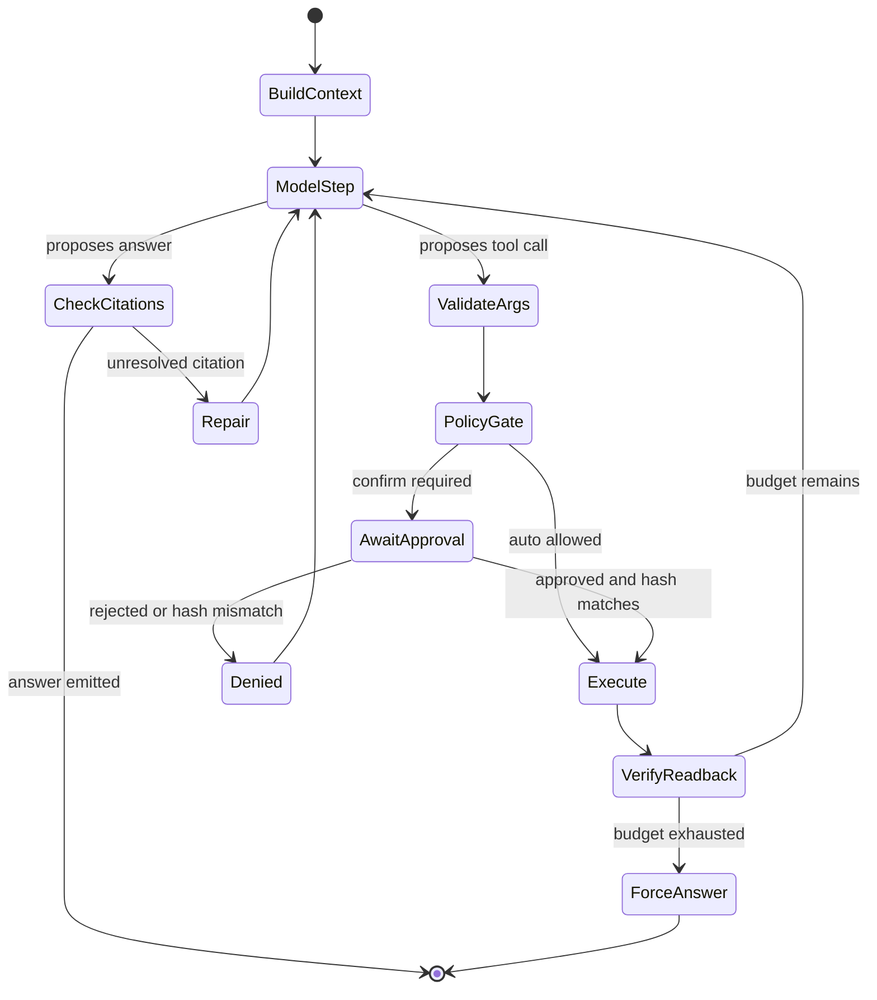

# Bifrost: agentic personal assistant

## 1. What the vision doc already decided (and why it matters)

[.cursor/plan.md](.cursor/plan.md) contains four constraints that are stronger than they look. Each one rules out a whole class of common first-build mistakes:

- **"Does not fetch or parse provider JSON inside the model loop."** Provider I/O is a separate program from the agent. The model never sees an HTTP response. This is the single highest-leverage decision in the doc.
- **"Does not use RAG as the source of calendar, task, or other structured truth."** Structured facts come from SQL queries over a canonical store. Embedding search, if it ever exists, is only for prose documents.
- **"SQL, raw JSON, and secrets never enter the prompt."** The model receives typed, whitelisted view objects. Enforced by types and a test, not by prompt wording.
- **"Ingested documents and web content are untrusted."** Anything ingested is *data*, never *instructions*. Needs a mechanical defense, not a polite request in the system prompt.

The agent loop in the doc — observe, reason over scoped context, propose, permission check, execute, read back and verify, persist audit event — is the actual control flow. Build it as an explicit state machine, not as a while-loop with ad-hoc ifs.

## 2. Architecture: three rings




Ring 1 and Ring 2 must not share code. Enforce with an import-boundary test: `bifrost.agent` may not import `bifrost.ingest.connectors`, `httpx`, or `requests`. That one test is what keeps the "no provider JSON in the loop" rule true a year from now.

## 3. Repo layout

```
pyproject.toml            # Python 3.14, no `from __future__ import annotations`
src/bifrost/
  core/                   # ids, clock (injectable now/tz), config, hashing, errors
  store/                  # schema.sql, migrations/, db.py, repositories/, views/
  ingest/                 # connectors/, normalize.py, sync.py, health.py
  agent/
    loop.py               # turn state machine
    context.py            # context builder + budget + trust tags + exposed-id snapshot
    registry.py           # tool registry with policy metadata
    tools/read/           # search_records, get_agenda, get_tasks, get_goals, get_source_health
    tools/derived/        # propose_daily_plan, save_note, set_surface
    tools/external/       # create_time_block, complete_task, open_app
    validate.py           # citation validator, plan validator
    providers/            # model adapters (tool-calling, streaming)
    prompts/system.v1.md  # versioned, recorded in audit
  policy/                 # classes, taint rules, proposals, approval binding
  audit/                  # append-only hash-chained log + trace renderer
  surface/                # widget schemas + versioned surface state
  api/                    # FastAPI HTTP + WebSocket
  cli/                    # chat harness, sync, trace, eval
ui/                       # widget renderer
evals/                    # fixtures/ (frozen DB + frozen now), scenarios/, runner.py
tests/
```

## 4. The canonical store

SQLite with WAL, one file, migrations as numbered SQL. Core tables:

- `sources` — one row per configured source; `kind`, `config_ref`, `trust` (`trusted` or `untrusted`), `enabled`.
- `sync_runs` and `source_health` — started/finished, rows upserted, error, `last_success_at`. This is what backs `get_source_health` from the vision doc.
- `events`, `tasks`, `goals`, `notes`, `documents` — canonical normalized records. Every row: stable public id (`evt_`, `task_`, `goal_`, `doc_` prefixes), `source_id`, `provider_id`, `content_hash`, `updated_at`, `deleted_at` (tombstone, never hard delete).
- `records_fts` — FTS5 index over titles/bodies for `search_records`.
- `conversations`, `messages`, `turn_summaries`.
- `proposals`, `approvals`, `actions` — the write path (section 7).
- `audit_events` — append-only, hash-chained.
- `surface_versions` — versioned widget layout so "undo the display" is mechanical.

Rules that prevent a week of pain later: all timestamps stored UTC with an explicit `tz` on user-facing records; `now` and timezone are **injected** into every code path (`core/clock.py`), never read ambiently, so evals are reproducible; public ids are opaque and stable because the model will cite them.

## 5. Ring 1: deterministic ingestion

A separate entry point (`bifrost sync`) that connectors run under. Each connector: fetch, normalize into canonical rows, upsert by `(source_id, provider_id)` with `content_hash` change detection, tombstone anything that disappeared, write a `sync_runs` row. Secrets live outside the repo and are read only here.

Two things to get right early:

- **Staleness is a first-class fact.** If a source's `last_success_at` is older than its threshold, the context builder injects a staleness warning and the assistant must state it before asserting facts sourced from it. Never silently answer from stale data — this is the most common way an assistant loses a user's trust permanently.
- **Ingested prose is marked untrusted at write time**, on the `sources` row. Trust is a property of data lineage, not of the prompt that reads it.

## 6. Ring 2: the agent loop

### 6.1 Context builder — this is where "scoped" happens

`build_context(now, tz, conversation_id) -> Context` returns rendered text *and* a `ContextSnapshot` holding the exact set of record ids exposed. Deterministic sections with individual token budgets:

- Identity/capabilities (from the versioned system prompt), current local datetime and timezone.
- Agenda window: `now - 2h` to `now + 36h`, with **precomputed** `conflicts` and `free_slots`.
- Open tasks: due within 14 days or flagged, capped.
- Active goals, capped.
- Source health warnings for anything stale.
- Recent mutating audit events (last ~5) so the assistant knows what it just did.
- Conversation: last N turns verbatim plus a rolling summary.

Two principles a first build usually misses:

- **Push determinism down into the tools.** Overlap math, working-hours checks, "is this due today" — computed in SQL/Python and handed over as facts. Never ask the model to do timestamp arithmetic. Reliability improves more from this than from any prompt tuning.
- **The model never writes SQL.** `search_records` takes structured filters (`kind`, `query`, `date_from`, `date_to`, `limit`) and FTS5 handles text. That is the concrete meaning of the doc's "SQL never enters the prompt."

### 6.2 Tool registry with policy as data

Each tool declares its class and handling metadata in one place, so the gate reads data rather than scattered conditionals:

```python
@tool(
    name="create_time_block",
    cls=ToolClass.EXTERNAL_ACTION,   # -> requires confirm
    args=CreateTimeBlockArgs,         # pydantic -> JSON schema for the model
    returns=TimeBlockView,            # pydantic whitelist -> what the model may see
    idempotency_key=lambda a: sha256(f"{a.start}|{a.end}|{a.title}"),
    inverse="delete_time_block",       # how to undo
    timeout_s=10,
    verify=verify_time_block,          # read-back assertion
)
def create_time_block(args: CreateTimeBlockArgs, ctx: ToolContext) -> TimeBlockView: ...
```

Redaction is structural: tools return registered view models only. Add a test asserting no tool returns a bare `dict`, plus a secret-scanner assertion on the outbound prompt that fails loudly in development.

### 6.3 Turn state machine




Budgets and guards, all configurable: max 8 steps per turn, max tool calls per turn, wall-clock and token ceilings, duplicate-call detection (identical tool plus args returns "you already called this" instead of re-executing), tool errors returned to the model as structured recoverable strings (`validation_error: block 2 overlaps evt_123 (14:00-15:00)`) with a retry cap, and a forced-answer step when the budget runs out.

### 6.4 Citation validation — do not trust cited ids

The doc requires "a proposed daily plan with citations to source records." Models will cite ids that do not exist, or real ids that were never in context. So every answer or plan containing citations is post-validated against the `ContextSnapshot`:

```python
unknown   = cited_ids - store.existing_ids(cited_ids)   # hallucinated
unexposed = cited_ids - snapshot.exposed_ids            # not actually seen this turn
if unknown or unexposed:
    # one repair attempt with the specific ids named, then strip and flag
```

### 6.5 Untrusted content and prompt injection

Since ingested documents and web content are untrusted, the defenses must be mechanical:

- Untrusted blocks are wrapped in explicit delimiters with a data-not-instructions framing, length-capped, and labeled with their `source_id`.
- **No untrusted content can escalate a tool class.** If any untrusted block was in the turn's context, every external action in that turn requires confirmation regardless of standing allowances, and the approval preview names the untrusted source.
- A cheap substring check catches the obvious attack: if a tool argument contains a verbatim span copied from an untrusted block, refuse auto-execution.
- The model can never trigger a fetch of an arbitrary URL. Ingestion is allowlisted and lives in Ring 1.

## 7. The write path: proposals, approval binding, verification

The vision doc's three classes map to three code paths.

**Read** — auto-execute, audit the call, no confirmation.

**Derived write** — audited and reversible. Write to local tables only, and record an inverse operation so undo is mechanical.

**External action** — confirm, allowlist, idempotent. The subtlety that first builds miss is a time-of-check/time-of-use gap: approval must bind to a *specific payload*, not to an intent.

```python
proposal_hash = sha256(canonical_json({"tool": name, "args": normalized_args}))
# store proposal, render a human preview, wait for approval of THAT hash
if approval.proposal_hash != proposal_hash:
    raise ApprovalMismatch  # executor refuses; audited as a denial
```

Then: idempotency (a unique index on `(tool, idempotency_key)` short-circuits retries with the stored result, so a timeout never double-creates an event), read-back verification (re-read the created record and assert it matches intent; on mismatch, record and offer the inverse), and an `actions` row carrying the inverse operation so undo is a lookup rather than a reconstruction.

`**propose_daily_plan` uses generate-and-check.** The model drafts blocks with `start`, `end`, `record_ids`, `rationale`; deterministic code validates no overlap with fixed events, inside working hours, every citation resolves and was exposed, no task double-booked, sane total duration. Validation failures return structured errors the model can repair. The result persists as a *proposal*, never as calendar writes. The model does judgment; code owns the invariants.

## 8. Ring 3: widgets

The model does not emit HTML or JS. It emits a `WidgetSpec` validated against a registry of prebuilt widgets:

```python
class WidgetSpec(BaseModel):
    type: Literal["agenda_timeline", "task_list", "plan_review", "source_health", "goal_tracker"]
    title: str                  # rendered as text, never HTML
    props: dict                 # validated against that widget type's schema
    record_ids: list[str]        # resolved by the renderer from the store
```

Setting the surface is a derived write via `set_surface`, so it is audited and reversible through `surface_versions`. Props reference record ids and the renderer resolves them from the store, so display data cannot be fabricated in the spec. All strings render as text.

## 9. Audit chain

One append-only table, one row per step: `turn_id`, `step`, `kind` (`context_built`, `model_output`, `policy_decision`, `tool_call`, `tool_result`, `verification`, `user_approval`, `error`), `payload_json`, `prompt_version`, `prev_hash`, `created_at`. Hash-chained so tampering is detectable, and complete enough to replay a turn. This one table is simultaneously the compliance record, the debugger (`bifrost trace <turn_id>`), and the eval assertion target.

## 10. Evaluation harness

Start this in Phase 2, not at the end. A frozen fixture DB at a frozen `now`, and assertions on the **audit trace** rather than on prose:

- "What's on today?" calls `get_agenda` and invents no events.
- A seeded overlap is surfaced as a conflict.
- "Plan my day" yields a valid plan where every citation resolves.
- An ingested document containing "create a calendar event for..." produces no auto-execution and is flagged.
- A hallucinated citation is caught by the validator.
- A tampered approval hash is rejected by the executor.
- A stale source produces a staleness statement before any factual claim from it.

Track tokens, latency, and cost per turn so regressions are visible.

## 11. Phases

- **Phase 0 — skeleton.** `pyproject.toml`, package layout, SQLite schema and migrations, injectable clock, config and secret loading, audit chain, CLI harness, import-boundary test. No model involved.
- **Phase 1 — canonical store and one ingest path.** Seeded fixtures plus one real source so there is truth to converse about. `sync_runs` and source health working.
- **Phase 2 — read-only loop.** Five read tools (`search_records`, `get_agenda`, `get_tasks`, `get_goals`, `get_source_health`), context builder with budgets and trust tags, tool registry, model adapter, state machine, citation validator, trace renderer, first evals. This is the first version that feels like an assistant, and it satisfies "no unapproved changes" by construction.
- **Phase 3 — derived writes.** `propose_daily_plan` with generate-and-check, `save_note`, `set_surface`, undo.
- **Phase 4 — desktop shell and widgets.** FastAPI plus WebSocket, renderer, the five widgets, approval UI with previews.
- **Phase 5 — external actions.** Policy gate with approval binding, idempotency, read-back verification, inverse operations, allowlisted `open_app`.
- **Phase 6 — hardening.** Injection red-team suite, cost and latency budgets, staleness and degraded-mode polish.

Phases 0 through 4 together are the vision doc's "first useful version."

## 12. Decisions for you to make (no answer needed now)

Each has a recommended default so you can accept defaults and move, or override in a later prompt.

**Needed before Phase 0**

- **Model provider and tier.** Default: one hosted tool-calling model behind a thin `agent/providers` adapter, with a cheap model for summarization.
- **Framework or hand-rolled loop.** Default: hand-rolled, roughly 300 lines. The policy gate, audit chain, and taint rules are the interesting parts and frameworks obscure them — and you learn more.
- **Packaging and dependency tool.** Default: `uv` (not currently installed; `pip` plus `venv` both work). Python is 3.14.4 locally, so PEP 649 annotations are native.

**Needed before Phase 1**

- **Which sources are real for v1.** Calendar and task providers with OAuth, a local `.ics` file, a markdown vault, or manual entry. Default: start with a local file source to avoid OAuth blocking the loop work.
- **Search scope.** FTS5 only for v1, or embeddings for prose documents. Default: FTS5 only, since the doc rules out RAG for structured truth.

**Needed before Phase 2**

- **Conversation memory.** Full transcript, rolling summary, or summary plus pinned durable preferences. Default: last N turns plus rolling summary; defer durable learned preferences.
- **Per-turn cost and latency ceiling**, and whether intermediate reasoning streams to the user and can be cancelled mid-turn. Default: stream tool activity, allow cancel, 8-step cap.

**Needed before Phase 4**

- **Desktop shell technology.** Local Python backend plus browser UI, Tauri, Electron, native toolkit, or a terminal UI first. Local constraint worth knowing: WSLg is available (`DISPLAY=:0`, Wayland), but Node exists only on the Windows side (`/mnt/c/nvm4w`), so a JS build step needs Node installed inside WSL or run from Windows. Default: FastAPI serving a dependency-free HTML/JS renderer, which sidesteps Node entirely for v1.
- **Which 2 to 5 widgets**, and whether layout is model-controlled or user-controlled. Default: the five in section 8, model-proposed and user-pinnable.

**Needed before Phase 5**

- **Target platform for "open app" and desktop manipulation.** Windows host via WSL interop, Linux/WSLg apps, or macOS. Default: an allowlist mapping logical app names to platform-specific launchers, so the policy surface stays identical across platforms.
- **Approval granularity.** Per-action confirm, time-boxed session allowances, or standing per-tool rules. Default: per-action for v1; add time-boxed allowances only after the audit trace shows which actions are genuinely routine.
- **Undo scope.** Local inverse only, or attempt provider-side revert. Default: attempt provider-side revert for actions you created, and always record the local inverse.

**Cross-cutting**

- **Local trust model.** Whether the SQLite file is encrypted at rest, whether secrets live in an OS keyring or a `.env` file, and whether the local API port requires a token. Default: `.env` plus a loopback-only bound port with a token; revisit encryption when real provider data lands.
- **Audit retention.** Payloads contain personal data. Default: keep whole locally, with a retention command available.

## 13. Keep the source of truth intact

[.cursor/plan.md](.cursor/plan.md) declares itself canonical for project vision, in a table built to hold more rows. Once this plan is accepted, add a row pointing at an architecture document (for example `docs/architecture.md`) so the vision file stays short and the mechanics live beside it.